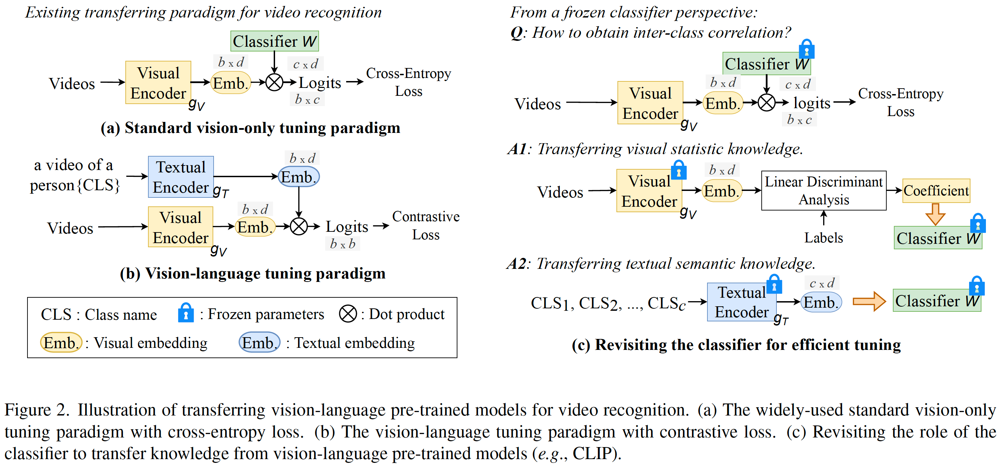

<div align="center">

<h1> 🔥【AAAI'2023】Revisiting Classifier: Transferring Vision-Language Models for Video Recognition </h1>

[](https://aaai-23.aaai.org/)
[](https://arxiv.org/abs/2207.01297)


[Wenhao Wu](https://whwu95.github.io/)<sup>1,2</sup>, [Zhun Sun](https://scholar.google.co.jp/citations?user=Y-3iZ9EAAAAJ&hl=en)<sup>2</sup>, [Wanli Ouyang](https://wlouyang.github.io/)<sup>3,1</sup>

 
<sup>1</sup>[The University of Sydney](https://www.sydney.edu.au/), <sup>2</sup>[Baidu](https://vis.baidu.com/#/), <sup>3</sup>[Shanghai AI Lab](https://www.shlab.org.cn/)


</div>

***
[](https://paperswithcode.com/sota/action-classification-on-kinetics-400?p=transferring-textual-knowledge-for-visual)
[](https://paperswithcode.com/sota/action-recognition-in-videos-on-activitynet?p=transferring-textual-knowledge-for-visual)
[](https://paperswithcode.com/sota/action-recognition-in-videos-on-ucf101?p=transferring-textual-knowledge-for-visual)
[](https://paperswithcode.com/sota/zero-shot-action-recognition-on-kinetics?p=transferring-textual-knowledge-for-visual)
[](https://paperswithcode.com/sota/zero-shot-action-recognition-on-activitynet?p=transferring-textual-knowledge-for-visual)
[](https://paperswithcode.com/sota/zero-shot-action-recognition-on-ucf101?p=transferring-textual-knowledge-for-visual)
[](https://paperswithcode.com/sota/zero-shot-action-recognition-on-hmdb51?p=transferring-textual-knowledge-for-visual)


This is the official implementation of the paper [Revisiting Classifier: Transferring Vision-Language Models for Video Recognition](https://arxiv.org/abs/2207.01297). 

<details ><summary>🙋 I also have other cross-modal video projects that may interest you ✨. </summary><p>


> [**Bidirectional Cross-Modal Knowledge Exploration for Video Recognition with Pre-trained Vision-Language Models**](https://arxiv.org/abs/2301.00182)<br>
> Accepted by CVPR 2023 | [[BIKE Code]](https://github.com/whwu95/BIKE)<br>
> Wenhao Wu, Xiaohan Wang, Haipeng Luo, Jingdong Wang, Yi Yang, Wanli Ouyang


> [**Cap4Video: What Can Auxiliary Captions Do for Text-Video Retrieval?**](https://arxiv.org/abs/2301.00184)<br>
> Accepted by CVPR 2023 as 🌟Highlight🌟 | [[Cap4Video Code]](https://github.com/whwu95/Cap4Video)<br>
> Wenhao Wu, Haipeng Luo, Bo Fang, Jingdong Wang, Wanli Ouyang

</p></details>


## 📣 Updates
- [x] **`Dec 22, 2022`** Models: The pre-trained models & logs.
- [x] **`Nov 30, 2022`** Config: All the configs (general/few-shot/zero-shot video recognition) on Kinetics-400 & 600, ActivityNet, UCF, and HMDB.
- [x] **`Nov 30, 2022`** Code: Zero-shot Evaluation: Half-classes evaluation and Full-classes evaluation.
- [x] **`Nov 28, 2022`** Code: Single-Machine/Multi-Machine Multi-GPU Distributed Training, Distributed testing.
- [x] **`Nov 19, 2022`** 🎉Our paper has been accepted by **AAAI-2023**.
- [x] **`Jul 1, 2022`** 💡Our [initial Arxiv paper](https://arxiv.org/abs/2207.01297v1) is released.


## 🌈 Overview
In our Text4Vis, we revise the role of the linear classifier and replace the classifier with the different knowledge from pre-trained model. We utilize the well-pretrained language model to generate good semantic target for efficient transferring learning.

  
  

## Content
- [Prerequisites](#prerequisites)
- [Data Preparation](#data-preparation)
- [Model Zoo](#model-zoo)
- [Training](#training)  
- [Testing](#testing)  
- [BibTeX & Citation](#bibtex)
- [Acknowledgment](#acknowledgment)


<a name="prerequisites"></a>
## 📕 Prerequisites
The code is built with following libraries:

- [PyTorch](https://pytorch.org/) >= 1.8
- RandAugment
- pprint
- tqdm
- dotmap
- yaml
- csv
- Optional: decord (for on-the-fly video training)
- Optional: torchnet (for mAP evaluation on ActivityNet)

<a name="data-preparation"></a>
## 📚 Data Preparation

#### Video Loader
**(Recommend)** To train all of our models, we extract videos into frames for fast reading. Please refer to [MVFNet](https://github.com/whwu95/MVFNet/blob/main/data_process/DATASETS.md) repo for the detaied guide of data processing.  
The annotation file is a text file with multiple lines, and each line indicates the directory to frames of a video, total frames of the video and the label of a video, which are split with a whitespace. Here is the format: 
```sh
abseiling/-7kbO0v4hag_000107_000117 300 0
abseiling/-bwYZwnwb8E_000013_000023 300 0
```

**(Optional)** We can also decode the videos in an online fashion using [decord](https://github.com/dmlc/decord). This manner should work but are not tested. All of the models offered have been trained using offline frames. Example of annotation:
```sh
abseiling/-7kbO0v4hag_000107_000117.mp4 0
abseiling/-bwYZwnwb8E_000013_000023.mp4 0
```

#### Annotation
Annotation information consists of two parts: video label, and category description.

- Video Label: As mentioned above, this part is same as the traditional video recognition. Please refer to `lists/k400/kinetics_rgb_train_se320.txt` for the format.
- Category Description: We also need a textual description for each video category.  Please refer to `lists/kinetics_400_labels.csv` for the format.


<a name="model-zoo"></a>
## 📱 Model Zoo

Here we provide some off-the-shelf pre-trained checkpoints of our models in the following tables.

*#Frame = #input_frame x #spatial crops x #temporal clips*
#### Kinetics-400

| Architecture |#Frame |  Top-1 Acc.(%) | checkpoint | Train log| config|
|:------------:|:-------------------:|:------------------:|:-----------------:|:--------------:|:--------------:|
| ViT-B/32 | 8x3x4 | 80.0 | [Github](https://github.com/whwu95/Text4Vis/releases/download/v1/k400-vitb-32-f8.pt) | [log](exps/k400/ViT-B/32/f8/log.txt) | [config](configs/k400/k400_train_rgb_vitb-32-f8.yaml) |
| ViT-B/32 | 16x3x4 | 80.5 | [Github](https://github.com/whwu95/Text4Vis/releases/download/v1/k400-vitb-32-f16.pt) | [log](exps/k400/ViT-B/32/f16/log.txt)  | [config](configs/k400/k400_train_rgb_vitb-32-f16.yaml) |
| ViT-B/16 | 8x3x4 | 82.9 | [Github](https://github.com/whwu95/Text4Vis/releases/download/v1/k400-vitb-16-f8.pt) | [log](exps/k400/ViT-B/16/f8/log.txt) | [config](configs/k400/k400_train_rgb_vitb-16-f8.yaml) |
| ViT-B/16 | 16x3x4 | 83.6 | [Github](https://github.com/whwu95/Text4Vis/releases/download/v1/k400-vitb-16-f16.pt)| [log](exps/k400/ViT-B/16/f16/log.txt) | [config](configs/k400/k400_train_rgb_vitb-16-f16.yaml) |
| ViT-L/14* | 8x3x4 | 86.4 | [OneDrive](https://unisyd-my.sharepoint.com/:u:/g/personal/wewu2985_sydney_edu_au/EdGV-r24UfFIjn8LRvcMtxwBEf3K0C0xP_XhqCVwuSrqVQ?e=YECrj6) | [log](exps/k400/ViT-L/14/f8/log.txt) | [config](configs/k400/k400_train_rgb_vitl-14-f8.yaml) |
| ViT-L/14-336 | 8x3x4 | 87.1 | [OneDrive](https://unisyd-my.sharepoint.com/:u:/g/personal/wewu2985_sydney_edu_au/EY2KV7M4MZFDv09JCgtkuJABn3KupI_TKVG2Nl3u-i9ilA?e=1CNZEV)  | [log](exps/k400/ViT-L/14-336px/f8/log.txt) | [config](configs/k400/k400_train_rgb_vitl-14-336-f8.yaml) |
| ViT-L/14-336 | 32x3x1 | 87.8 | [OneDrive](https://unisyd-my.sharepoint.com/:u:/g/personal/wewu2985_sydney_edu_au/EWsVZ4RdokdChpE1RTM4ibsBHmoPnllRYv5xHb_rK2FaEA?e=iDpPfY) | [log](exps/k400/ViT-L/14-336px/f32/log.txt) | [config](configs/k400/k400_train_rgb_vitl-14-336-f32.yaml) |

*Note: * indicates that this ViT-L model is used for the zero-shot evaluation on UCF, HMDB, ActivityNet and Kinetics-600.*

#### ActivityNet
| Architecture |#Frame |  mAP (%) | checkpoint | Train log| config|
|:------------:|:-------------------:|:------------------:|:-----------------:|:--------------:|:--------------:|
| ViT-L/14 | 16x1x1 | 96.5 | [OneDrive](https://unisyd-my.sharepoint.com/:u:/g/personal/wewu2985_sydney_edu_au/Efreue0XeWBIvtPXvoSjswcBd6ZiuNOdstG_jvhhLsjgQA?e=8HJ9Hq) | [log](exps/anet/ViT-L/14/f16/log.txt) | [config](configs/anet/anet_k400_finetune.yaml) |
| ViT-L/14-336 | 16x1x1 | 96.9 | [OneDrive](https://unisyd-my.sharepoint.com/:u:/g/personal/wewu2985_sydney_edu_au/EdWqlmbwFVxChYHie5VfXocBgSVtEDpANa34u3HbQJk9bQ?e=ZILIiS) | [log](exps/anet/ViT-L/14-336px/f16/log.txt) | [config](configs/anet/anet_k400_finetune_336.yaml) |

#### UCF-101
| Architecture |#Frame |  Top-1 Acc. (%) | checkpoint | Train log| config|
|:------------:|:-------------------:|:------------------:|:-----------------:|:--------------:|:--------------:|
| ViT-L/14 | 16x1x1 | 98.1 | [OneDrive](https://unisyd-my.sharepoint.com/:u:/g/personal/wewu2985_sydney_edu_au/Ec6KeUdxH_lGoJG2608ia7ABSTuT0u4UgrHalABvqeZb7g?e=2Jyb7M) | [log](exps/ucf101/ViT-L/14/f16/log.txt) | [config](configs/ucf101/ucf_k400_finetune.yaml) |
<!-- | ViT-L/14-336 | 16x1x1 | 98.2 | - | [log](exps/ucf101/ViT-L/14-336px/f16/log.txt) | [config](configs/ucf101/ucf_k400_finetune_336.yaml) | -->

#### HMDB-51
| Architecture |#Frame |  Top-1 Acc. (%) | checkpoint | Train log| config|
|:------------:|:-------------------:|:------------------:|:-----------------:|:--------------:|:--------------:|
| ViT-L/14 | 16x1x1 | 81.3 | [OneDrive](https://unisyd-my.sharepoint.com/:u:/g/personal/wewu2985_sydney_edu_au/EdL3-B2TqTRArrXbK5Go_jgB89bLk8oUHlzHDq1pdr4EUA?e=brWaFg) | [log](exps/hmdb51/ViT-L/14/f16/log.txt) | [config](configs/hmdb51/hmdb_k400_finetune.yaml) |


<a name="training"></a>
## 🚀 Training
This implementation supports Multi-GPU `DistributedDataParallel` training, which is faster and simpler than `DataParallel` used in [ActionCLIP](https://github.com/sallymmx/actionclip). 

- **Single Machine**: To train our model on Kinetics-400 with 8 GPUs in *Single Machine*, you can run:
```sh
# For example, train the 8 Frames ViT-B/32.
sh scripts/run_train.sh  configs/k400/k400_train_rgb_vitb-32-f8.yaml
```

- **Mulitple Machines**: We also provide the script to train larger model with *Mulitple Machines* (e.g., 2 machines and 16 GPUs), you can run:
```sh
# For example, we train the 8 Frames ViT-L/14 with 2 machines as follows:
# For first machine, you need to set the ip of your first machine as the --master_addr, --nnodes is 2.
# Compared with the Single-Machine training script, only one node_id needs to be added.
sh scripts/run_train_multinodes.sh configs/k400/k400_train_rgb_vitl-14-f8.yaml 0

# For second machine, --master_addr is still the ip of your first machine
sh scripts/run_train_multinodes.sh configs/k400/k400_train_rgb_vitl-14-f8.yaml 1
```

- **Few-shot Recognition**: To train our model under *Few-shot* scenario, you just need to add one line in the general config file:
```sh
# You can refer to config/k400/k400_few_shot.yaml
data: 
    ...  # general configurations
    shot: 2  # i.e., 2-shot setting
```

<a name="testing"></a>
## ⚡ Testing
We support single view validation and multi-view (4x3 views) validation.

#### General/Few-shot Video Recognition
```sh
# Single view evaluation. e.g., ViT-B/32 8 Frames on Kinetics-400
sh scripts/run_test.sh  configs/k400/k400_train_rgb_vitb-32-f8.yaml exp/k400/ViT-B/32/f8/last_model.pt

# Multi-view evalition (4clipsx3crops). e.g., ViT-B/32 8 Frames on Kinetics-400
sh scripts/run_test.sh  configs/k400/k400_train_rgb_vitb-32-f8.yaml exp/k400/ViT-B/32/f8/last_model.pt --test_crops 3  --test_clips 4
```


#### Zero-shot Evaluation

We use the Kinetics-400 pre-trained model (e.g., ViT-L/14 with 8 frames) to perform cross-dataset zero-shot evaluation, i.e., UCF101, HMDB51, ActivityNet, Kinetics-600.

- Half-classes Evaluation: A traditional evaluation protocol involves selecting half of the test dataset's classes, repeating the process ten times, and reporting the mean accuracy with a standard deviation of ten times.


- Full-classes Evaluation: Perform evaluation on the entire dataset.

```sh
# On ActivityNet: reporting the half-classes and full-classes results
sh scripts/run_test_zeroshot.sh  configs/anet/anet_zero_shot.yaml exp/k400/ViT-L/14/f8/last_model.pt

# On UCF101: reporting the half-classes and full-classes results
sh scripts/run_test_zeroshot.sh  configs/ucf101/ucf_zero_shot.yaml exp/k400/ViT-L/14/f8/last_model.pt

# On HMDB51: reporting the half-classes and full-classes results
sh scripts/run_test_zeroshot.sh  configs/hmdb51/hmdb_zero_shot.yaml exp/k400/ViT-L/14/f8/last_model.pt

# On Kinetics-600: manually calculating the mean accuracy with standard deviation of three splits.
sh scripts/run_test.sh  configs/k600/k600_zero_shot_split1.yaml exp/k400/ViT-L/14/f8/last_model.pt
sh scripts/run_test.sh  configs/k600/k600_zero_shot_split2.yaml exp/k400/ViT-L/14/f8/last_model.pt
sh scripts/run_test.sh  configs/k600/k600_zero_shot_split3.yaml exp/k400/ViT-L/14/f8/last_model.pt
```


<a name="bibtex"></a>
## 📌 BibTeX & Citation
If you find this repository useful, please star🌟 this repo and cite📑 our paper:

```
@article{wu2023revisiting,
  title={Revisiting Classifier: Transferring Vision-Language Models for Video Recognition},
  author={Wu, Wenhao and Sun, Zhun and Ouyang, Wanli},
  booktitle={Proceedings of AAAI Conference on Artificial Intelligence (AAAI)},
  year={2023}
}
```


<a name="acknowledgment"></a>
## 🎗️ Acknowledgement

This repository is built based on [ActionCLIP](https://github.com/sallymmx/actionclip) and [CLIP](https://github.com/openai/CLIP). Sincere thanks to their wonderful works.


## 👫 Contact
For any question, please file an issue or contact [Wenhao Wu](https://whwu95.github.io/)

